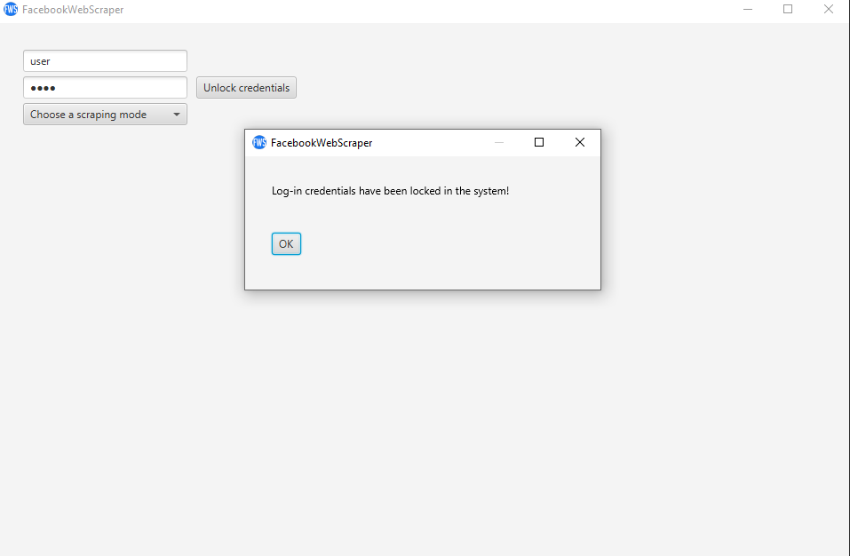
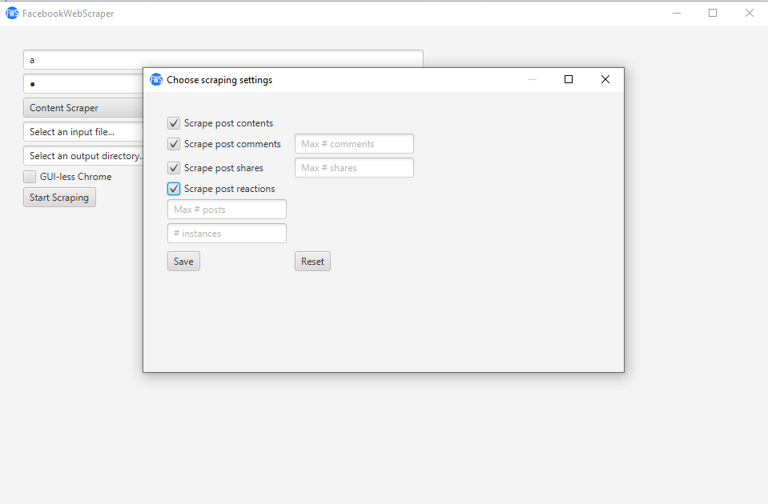
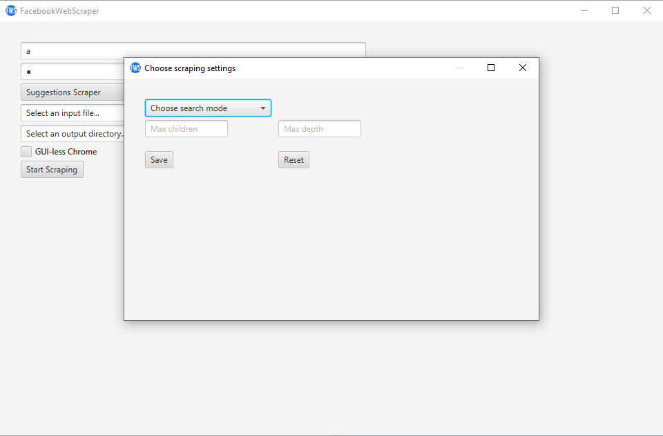
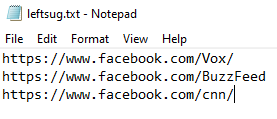
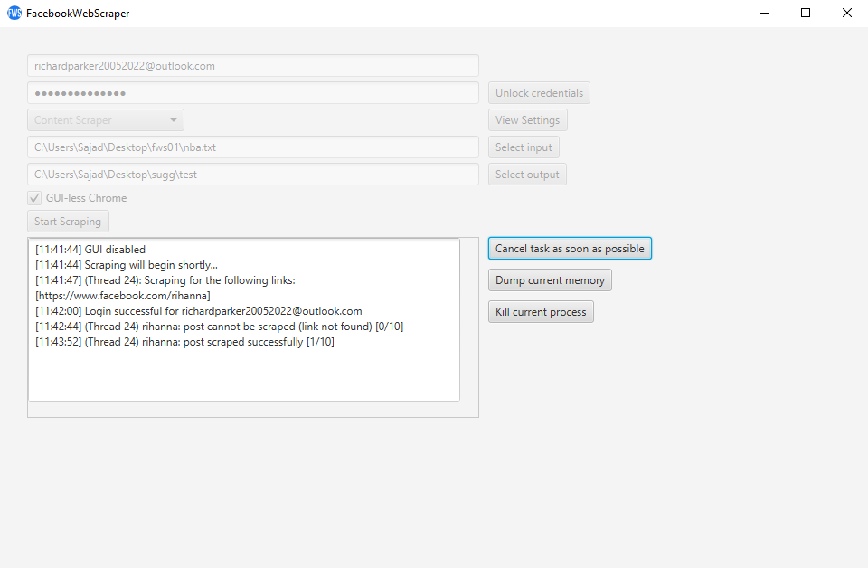

# McGill Research Project

This project was developed as part of a research project with [Prof. Joseph Vybihal's](https://www.cs.mcgill.ca/~jvybihal/index.php?Page=Home) lab. As a student research developer, I was tasked with making an application that could determine if social media platforms are subject to siloing. In the context of this research project, I developed an application that roams Facebook with the purpose of discover any such phenomenon on the platform.

# Technologies used

 
   
  
  
   
   
 

# How to get access to FacebookWebScraper

You can access the application by git cloning this repository and running this maven command in your IDE of choice (recommended to use IntelliJ):

`mvn clean install`

You can also download the latest version of this application using this link: [FacebookWebScraper.jar](https://drive.google.com/file/d/1LTvAyHI3-g1k-W_XXZVFxU1gRj_M1tne/view?usp=sharing)
# System Requirements

Operating System: required Windows, recommended Windows 10/11.

Chrome Version: required 103.X, recommended 103.0.5060.114

JDK Version: required 15.0.X, recommended 15.0.1

# How to use FacebookWebScraper

FacebookWebScraper can either be ran through the GUI or as a Java Application.

## Running the program through the GUI

### Setting a login
To have access to any features provided by the application, the user must first set a username/email and a password. Once these credentials are locked, the user will have access to scraping settings.

### Configuring the settings
To select the settings, the user must first select a scraping mode. Currently, the two options are Content Scraper and Suggestions Scraper.

**For Content Scraper the settings are the following:**

- Scrape post contents: Will save the text area contained in the post

- Scrape post comments: Will save as many comments as possible until the input maximum is reached

- Scrape post shares: Will load the input maximum amount of shares and will save all the non-null captions on them

- Scrape post reactions: Will save the reactions on the post

- Max # posts: Will load the input maximum amount of posts and run the scraper on as many article-style posts

- \# instances: Will run the input amount of concurrent instances using the same login, splitting the input file evenly among all instances. Default is 1.

**For Suggestions Scraper the settings are the following:**

- Choose search mode: run the BFS or DFS tree search algorithms on the suggestions
- Max children: Set the maximum amount of suggestions/children any given page can have
- Max depth: Set the maximum depth or distance away from the root any page can have

### Setting the input
The input must be a ".txt" file containing a list of valid Facebook URLs to pages. Any invalid Facebook URL will be skipped or may result in the program terminating after a certain amount of failures.

### Setting the output
The output must be a directory.

### Running the browser GUI-lessly
By clicking the option, although it will not make a massive difference in performance, it allows the user to keep using their computers while the scrape is happening in the background.

### Scraping process
Once the user has started the scrape, the log console will appear. This console is read-only and serves the purposes of keeping track of the program and making sure everything works properly. In the case where a user must cancel a task, the "Cancel Task" button will safely cancel the task after the current post/suggestion scrape is over. The "Dump Memory" button will losslessly output the current data saved in memory into a "dump" folder in the output directory. The "Kill Process" button is meant to be used only if the "Cancel Task" button did not work or if the program is stuck in an infinite loop. It will attempt to dump the memory and subsequently kill the chromedriver as well as the current process.

## Running the program through a Java application

In the FacebookWebScraper.java main method, add the following code.

### Setting the login
`LOGIN.setEmail(email);`
`LOGIN.setPassword(password)`

### General Settings
If the user wants to use chrome GUI-lessly, use the following method:
`settings.setHeadless(true);`

The user must set an input File
`settings.setInput(file)`

The user must set an output path directory
`settings.setOutput(path)`

### For Content Scraping

`ContentScraperSettings settings = new ContentScraperSettings(boolean, boolean, boolean, boolean, integer);`

Note that the constructor for ContentScraperSettings is the following:
`public ContentScraperSettings(boolean saveContent, boolean saveComments, boolean saveShares, boolean saveReactions, int amountOfPosts)`

If the user decides to save comments or shares, the default value is 10. It can be changed using the following methods:
`settings.setAmountOfComments(value);`
`settings.setAmountOfShares(value);`

If the user wants to use multithreading, use the following method:
`settings.setInstanceCount(value);`

Once you have set the input and output, you can run the scraper.

To run the scraper do the following:
`ContentScraper scraper = new ContentScraper(settings);`
`scraper.runScraper();`

### For Suggestions Scraping
`SuggestionsScraperSettings settings = new SuggestionsScraperSettings(InteractionModeEnum.NULL_INTERACTION, SearcherEnum, integer, integer);`

Note that the constructor for SuggestionsScraperSettings is the following:
`public SuggestionsScraperSettings(InteractionModeEnum interactionMode, SearcherEnum searcher, int maxDepth, int maxGrowth)`

As of now, no interaction modes have been implemented, thus the user must use InteractionModeEnum.NULL_INTERACTION. For DFS use SearcherEnum.DFS. For BFS use SearcherEnum.BFS

To run the scraper do the following:
`SuggestionsScraper scraper = new SuggestionScraper(settings);`
`scraper.runScraper();`

